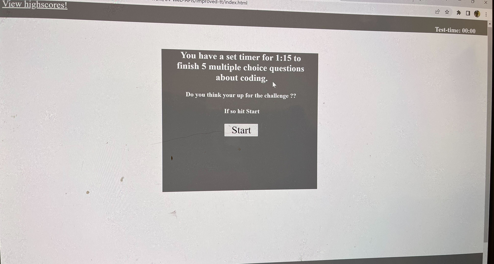
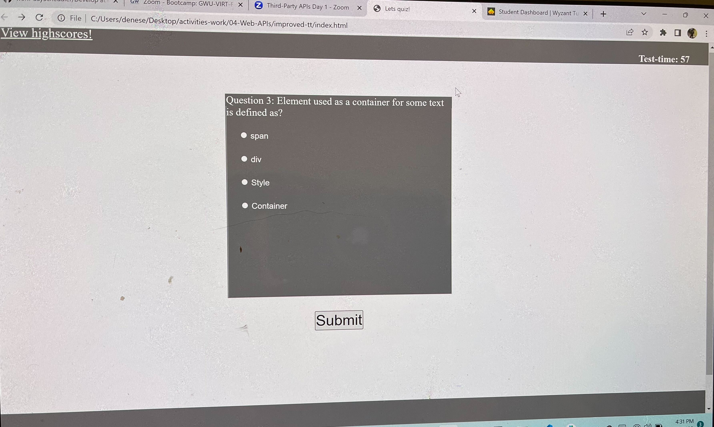
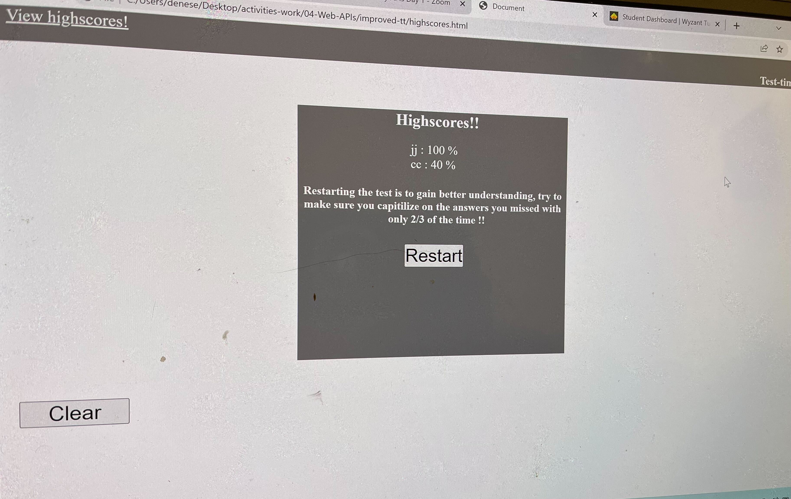

# 04 Web APIs: Code Quiz

## Fully functional 5 question coding quiz 
This project was built in Vs Code, it is an 5 question generated coding quiz to help people understand how the creation process took place in creating a coding qquiz using radio buttons for user input, after you finished the test or run out of time which at first is 75 seconds, later if your restart the test is 50 seconds, it  then prompts you to input your nickname, then places your score on a highscore container with the ability to clear it and start over. This code shows how to do the following:

* Start a timer element on the click of the start quiz button, that subtracts until it hits 0
* Render questions on the click of start button
* Give user feedback if the answer was right or wrong
* Render next question after selecting answer until none are left
*Can save nickname for highscore after questions are answered or timer hits 0

## Visual Helper
start up screen

questions

highscore page

## Installation instructions
* To install this You will first need Visual Studio Code
 * To install this you will need Git Bash, or a terminal that is convienent for your computer
## Usage
 * Step 1- you will want to create a folder using your terminal anyname works!
 * step 2- you want to create a repository to your local environment(Terminal) using command- git init
 * step 3- you will want to open up this code from your terminal onto Visual Studio Code using command- code .
 * Step 4- once VS-Code is open you will click open folder, and find the folder you named in (step #1)
 * Step 5- you will notice that the folder is empty, go ahead and create 4 new files  and rename them(index.html,and style.css) by right clicking over the untitled file, then click rename!
 * Step 6- Go ahead back to where you found my gitgub pages, and copy the index.html, and paste it into yours!
 * Step 7- Go ahead back to where you found my gitgub pages, and copy the style.css, and paste it into yours!
 * Step 8- Go ahead back to where you found my gitgub pages, and copy the highscores.html, and paste it into yours!
 * Step 9- Go ahead back to where you found my gitgub pages, and copy the Javacript, and paste it into yours!
 * Step 10- From here on out this is where you can edit the code to better reflect your own touch to creativity!!
* **Urgent** on line 5 of index you will see my relative pathway for my project, your relative pathway most likely will differ, so go ahead and change it so the index.html, and style.css can work like teamates also in my index html on line 11 is where my href tag is so that your anchor tag goes directly to the highscore page, also ihave it in line 157 of my javascript that relocates to this page on the call of the function!
## For help
*please refer to this video for help on relative pathways- https://www.youtube.com/watch?v=hxto_sRZsBg 
 * please refer to this video for help on Creating folders & files using your terminal- https://www.youtube.com/watch?v=cllYCk-MYek

## Liscence
MIT License

Copyright (c) [2023] [Tyler Henderson Webster]

Permission is hereby granted, free of charge, to any person obtaining a copy
of this software and associated documentation files (the "Software"), to deal
in the Software without restriction, including without limitation the rights
to use, copy, modify, merge, publish, distribute, sublicense, and/or sell
copies of the Software, and to permit persons to whom the Software is
furnished to do so, subject to the following conditions:

The above copyright notice and this permission notice shall be included in all
copies or substantial portions of the Software.

THE SOFTWARE IS PROVIDED "AS IS", WITHOUT WARRANTY OF ANY KIND, EXPRESS OR
IMPLIED, INCLUDING BUT NOT LIMITED TO THE WARRANTIES OF MERCHANTABILITY,
FITNESS FOR A PARTICULAR PURPOSE AND NONINFRINGEMENT. IN NO EVENT SHALL THE
AUTHORS OR COPYRIGHT HOLDERS BE LIABLE FOR ANY CLAIM, DAMAGES OR OTHER
LIABILITY, WHETHER IN AN ACTION OF CONTRACT, TORT OR OTHERWISE, ARISING FROM,
OUT OF OR IN CONNECTION WITH THE SOFTWARE OR THE USE OR OTHER DEALINGS IN THE
SOFTWARE.
© 2023 edX Boot Camps LLC. Confidential and Proprietary. All Rights Reserved.
## Review

You are required to submit BOTH of the following for review:

* The URL of the functional, deployed application.
https://tyythedeveloper33.github.io/test-time-improve/

* The URL of the GitHub repository.
https://github.com/Tyythedeveloper33/test-time-improve

